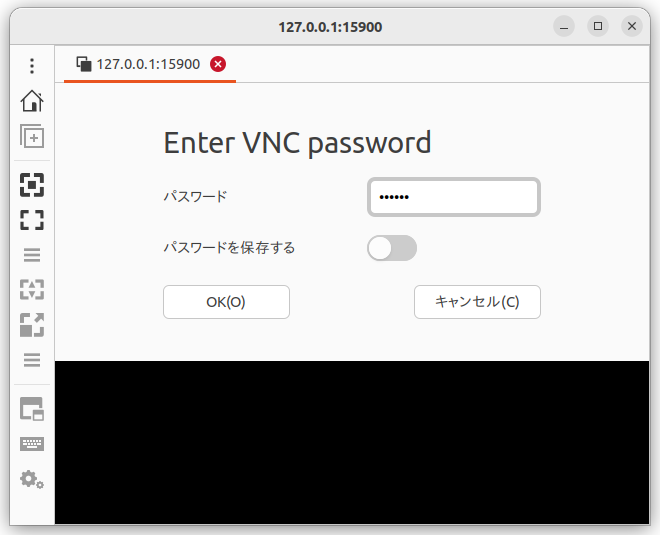

# Dockerイメージの使い方（改訂第2版）

ROS 2とPythonで作って学ぶAIロボット入門 改訂第2版（出村・萩原・升谷・タン著，講談社，以下では「この本」と書きます）のためのDockerイメージの使い方を説明します．

## 概要

- Dockerを使ってこの本の教材をすぐに試すことのできるデスクトップ環境を提供します．**Linuxでは，ハードウェアの利用も可能なのでロボット実機も動かすことができます．Windowsでは，ハードウェアの利用はできないので実機は動きませんが，シミュレーションの実行は可能です．Intelまたはその互換の64bitのCPUでのみ動作します．**
- 提供するDockerのイメージには以下の内容が含まれており，個別のインストールは不要です．
  - Ubuntu 22.04 MATEデスクトップ環境（日本語化済み）
  - テキストエディタ VS Codium
  - ROS 2 Humble
  - この本の教材に必要なパッケージ・ライブラリ
  - この本のサンプルプログラム
- Dockerイメージの作り方については，この文書では説明しません．[こちらのリポジトリ](https://github.com/AI-Robot-Book-Humble/docker-ros2-desktop-ai-robot-book-humble)を見てください．

## 目次

- [Ubuntu Linuxの場合](#ubuntu-linuxの場合)
- [Windowsの場合](#windowsの場合)
- [デスクトップ環境の使い方（共通事項）](#デスクトップ環境の使い方共通事項)
- [ハードウェアの使い方](#ハードウェアの使い方)
- [ヘルプ](#ヘルプ)
- [著者](#著者)
- [履歴](#履歴)
- [参考文献](#参考文献)

## Ubuntu Linuxの場合

### Dockerのインストール

コンピュータがインターネットに接続している状態で，端末ウィンドウに以下を入力します．
```
sudo apt install docker.io
sudo adduser $USER docker
reboot
```

### Dockerイメージのプル（ダウンロード）

- 利用するコンピュータをインターネットに接続します．
- DockerHubで公開しているこの本のDockerイメージをプル（ダウンロード）し，タグ名を変更するシェルスクリプトを用意しました．
  - [ここからシェルスクリプトarb-pull.bash](https://raw.githubusercontent.com/AI-Robot-Book-Humble/docker-ros2-desktop-ai-robot-book-humble/refs/heads/main/arb-pull.bash)をダウンロードします．
  - ダウンロードしたファイルを適当なディレクトリに置きます．
  - 端末ウィンドウを開き，以下を入力して実行します．
    ```
    cd arb-pull.bashを置いたディレクトリ
    chmod +x arb-pull.bash # 初回だけ
    ./arb-pull.bash
    ```
- DockerHubからイメージ（約17.4GB）をプル（ダウンロード）するので，かなり時間がかかります．

### Dockerコンテナの起動

- 起動コマンドが長いので，それを毎回入力しなくて済むようにシェルスクリプトを用意しました．
  - [ここからシェルスクリプトarb-run.bash](https://raw.githubusercontent.com/AI-Robot-Book-Humble/docker-ros2-desktop-ai-robot-book-humble/refs/heads/main/arb-run.bash)をダウンロードします．
  - ダウンロードしたファイルを適当なディレクトリに置きます．
  - 端末ウィンドウを開き，以下を入力して実行します．
    ```
    cd arb-run.bashを置いたディレクトリ
    chmod +x arb-run.bash # 初回だけ
    ./arb-run.bash
    ```
- ずらずらと文字が表示され，最後に以下のような内容が表示されたら，コンテナの準備完了です．
  ```
  2025-02-09 20:22:23,684 INFO success: novnc entered RUNNING state, process has stayed up for > than 1 seconds (startsecs)
  2025-02-09 20:22:23,685 INFO success: vnc entered RUNNING state, process has stayed up for > than 1 seconds (startsecs)
  ```

### Dockerコンテナによるデスクトップ環境の利用

コンテナが提供するデスクトップ環境の利用方法は複数あります．

- ウェブブラウザを使う場合

  - ウェブブラウザを起動する．
  - アドレス欄に「`http://127.0.0.1:6080`」と入力しEnterキーを押します．
  - ブラウザ内に以下のような内容が表示されれますので，中央の「接続」ボタンをクリックします．  
    

  - MATEデスクトップ環境が表示されます．  
    

  - 画面の左辺のタブをクリックしてnoVNCのメニューアイコンを表示し，「Full Screen」のアイコンをクリックして，全画面表示にします．  
    

  - 全画面表示になればOKです．  
    

  - デスクトップ環境での操作は他と共通ですので，後述します．

  - 終わりたい場合は，ログアウトやサインアウトは要りません．noVNCのメニューを出し，「切断」のアイコン（1番下）をクリックします．ウェブブラウザ（のタブ）も閉じて構いません．

- Remminaを使う場合

  - Remmina（Ubuntu標準のリモートデスクトップクライアント）を起動します．  
    

  - アドレス欄の左側をクリックしてプロトコルとして「VNC」を選び，アドレス欄に「127.0.0.1:15900」を入力しEnterキーを押します．  
    

  - 別のウィンドウが現れ，パスワードを求められるので，「ubuntu」と入力します．  
    

  - ウィンドウ左辺のアイコンの並びの中から「全画面モードのオン/オフ」をクリックします．  
    

  - 全画面表示になればOKです．  
    

  - デスクトップ環境での操作は他と共通ですので，後述します．

  - 終わりたい場合は，ログアウトやサインアウトは要りません．画面の上辺にマウスカーソルを移動させて，RemminaのNCのメニューを出し，「切断」のアイコンをクリックします．最初のRemminaのウィンドウも閉じて構いません．  
    

### Dockerコンテナの中断

デスクトップ環境を切断しただけでは，まだコンテナはメモリ上に存在しています．これを停止するには，別の端末ウィンドウを開いて，以下のように入力しEnterキーを押します．
```
docker stop ai_robot_book
```
`ai_robot_book`はコンテナを起動したときにコンテナに付けた名前です．

### Dockerコンテナの再開

停止したコンテナを再び使えるようにするには，端末ウィンドウで以下のように入力しEnterキーを押します．
```
docker start ai_robot_book
```

### Dockerコンテナのコミット（イメージへの保存）

- `ai_robot_book`コンテナの内容をコミット（Dockerイメージとして保存）するシェルスクリプトを用意しました．
  - [ここからシェルスクリプトarb-commit.bash](https://raw.githubusercontent.com/AI-Robot-Book-Humble/docker-ros2-desktop-ai-robot-book-humble/refs/heads/main/arb-commit.bash)をダウンロードします．
  - ダウンロードしたファイルを適当なディレクトリに置きます．
  - 端末ウィンドウを開き，以下を入力して実行します．
    ```
    cd arb-commit.bashを置いたディレクトリ
    chmod +x arb-commit.bash # 初回だけ
    ./arb-commit.bash
    ```
- Dockerコンテナ上で作業内容がDockerイメージに反映され，次にDockerコンテナを起動する場合に利用されます．

### Dockerコンテナの削除

Dockerコンテナ上での作業内容を全て破棄して，コンテナを削除するには，端末ウィンドウで以下のように入力しEnterキーを押します．
```
docker rm ai_robot_book
```

## Windowsの場合

### Dockerのインストール

[公式のドキュメント](https://docs.docker.com/desktop/setup/install/windows-install/)に従って「Docker Desktop for Windows」をインストールしてください．

### Dockerイメージのプル（ダウンロード）

- 利用するコンピュータをインターネットに接続します．
- Docker Desktopを起動します．
- DockerHubで公開しているこの本のDockerイメージをプル（ダウンロード）し，タグ名を変更するバッチファイルを用意しました．
  - [ここからバッチファイルarb-pull.bat](https://raw.githubusercontent.com/AI-Robot-Book-Humble/docker-ros2-desktop-ai-robot-book-humble/refs/heads/main/arb-pull.bat)をダウンロードします．
  - ダウンロードしたファイルを適当なディレクトリ（フォルダ）に置きます．
  - エクスプローラでディレクトリを開き，アドレス欄に「cmd」と入力しEnterキーを押します．すると，そこをカレントディレクトリとしてコマンドプロンプトが起動します．
  - コマンドプロンプトのウィンドウ内で以下を入力して実行します．
    ```
    arb-pull
    ```
- DockerHubからイメージ（約17.4GB）をプル（ダウンロード）するので，かなり時間がかかります．

### Dockerコンテナの起動

- Docker Desktopが実行中であることを確認します．
- 起動コマンドが長いので，それを毎回入力しなくて済むようにバッチファイルを用意しました．
  - [ここからバッチファイルarb-run.bat](https://raw.githubusercontent.com/AI-Robot-Book-Humble/docker-ros2-desktop-ai-robot-book-humble/refs/heads/main/arb-run.bat)をダウンロードします．
  - ダウンロードしたファイルを適当なディレクトリに置きます．
  - エクスプローラでディレクトリを開き，アドレス欄に「cmd」と入力しEnterキーを押します．すると，そこをカレントディレクトリとしてコマンドプロンプトが起動します．
  - コマンドプロンプトのウィンドウ内で以下を入力して実行します．
    ```
    arb-run
    ```
- ずらずらと文字が表示され，最後に以下のような内容が表示されたら，コンテナの準備完了です．
  ```
  2025-02-09 20:22:23,684 INFO success: novnc entered RUNNING state, process has stayed up for > than 1 seconds (startsecs)
  2025-02-09 20:22:23,685 INFO success: vnc entered RUNNING state, process has stayed up for > than 1 seconds (startsecs)
  ```

### Dockerコンテナによるデスクトップ環境の利用

Dockerコンテナが提供するデスクトップ環境の利用方法は複数あります．

- ウェブブラウザを使う場合

  - ウェブブラウザを起動する．
  - アドレス欄に「`http://127.0.0.1:6080`」と入力しEnterキーを押します．

  - ブラウザ内に以下のような内容が表示されれますので，中央の「接続」ボタンをクリックします．  
    

  - MATEデスクトップ環境が表示されます．  
    

  - 画面の左辺のタブをクリックしてnoVNCのメニューアイコンを表示し，「Full Screen」のアイコンをクリックして，全画面表示にします．  
    

  - 全画面表示になればOKです．  
    

  - デスクトップ環境での操作は他と共通ですので，後述します．

  - 終わりたい場合は，ログアウトやサインアウトは要りません．noVNCのメニューを出し，「切断」のアイコンをクリックします．ウェブブラウザ（のタブ）も閉じて構いません．

- VNCビューアを使う場合

  - Windowsで使うことのできるVNCビューアには色々ありますが，ここではTightVNC Viewerを使います．[公式サイト](https://www.tightvnc.com/download.php)から「TightVNC for Windows」のインストーラをダウンロードし，インストールしてください．TightVNC Viewerはその中に含まれています．
  - Windowsのスタートメニューか検索からTightVNC Viewerを見つけ起動します．  
    

  - 「Remote Host」欄に「127.0.0.1:15900」を入力し，「Connect」をクリックします．  
    

  - 別のウィンドウが現れ，パスワードを求められるので，「ubuntu」と入力します．  
    

  - ウィンドウ上部のアイコンの並びの中から「Full screen」をクリックします．  
    

  - パネルに説明されているように，全画面表示から戻るにはCtrl+Shift+Alt+Fの4個のキーを同時押しします．それを了解したら，パネルの「OK」をクリックします．  
    

  - 前画面表示になります．  
    

  - デスクトップ環境での操作は他と共通ですので，後述します．

  - 終わりたい場合は，ログアウトやサインアウトは要りません．全画面表示から戻り，ウィンドウの閉じるボタンをクリックします．

### Dockerコンテナの中断

デスクトップ環境を切断しただけでは，まだDockerコンテナはメモリ上に存在しています．これを停止するには，Docker Desktopで操作します．Docker Desktopのウィンドウを開き，左側のメニューの「Containers」をクリックしてコンテナの一覧を表示します．一覧には「ai_robot_book」の1行だけが表示されているはずです．「ai_robot_book」の行の「Stop」のアイコンをクリックしてください．なお，「ai_robot_book」はコンテナを起動したときにコンテナに付けた名前です．  


### Dockerコンテナの再開

停止したDockerコンテナを再び使えるようにするには，Docker Desktopのウィンドウをを開き，「Containers」の中の「ai_robot_book」の行の「Start」のアイコンをクリックしてください．  


### Dockerコンテナのコミット（イメージへの保存）

- `ai_robot_book`コンテナの内容をコミット（Dockerイメージとして保存）するバッチファイルを用意しました．
  - [ここからバッチファイルarb-commit.bat](https://raw.githubusercontent.com/AI-Robot-Book-Humble/docker-ros2-desktop-ai-robot-book-humble/refs/heads/main/arb-commit.bat)をダウンロードします．
  - ダウンロードしたファイルを適当なディレクトリに置きます．
  - エクスプローラでディレクトリを開き，アドレス欄に「cmd」と入力しEnterキーを押します．すると，そこをカレントディレクトリとしてコマンドプロンプトが起動します．
  - コマンドプロンプトのウィンドウ内で以下を入力して実行します．
    ```
    arb-commit
    ```
- Dockerコンテナ上での作業内容がDockerイメージに反映され，次にDockerコンテナを起動する場合に利用されます．

### Dockerコンテナの削除

Dockerコンテナ上での作業内容を全て破棄して，コンテナを削除するには，Docker Desktopのウィンドウをを開き，「Containers」の中の「ai_robot_book」の行の「Delete」のアイコンをクリックしてください．  


## デスクトップ環境の使い方（共通事項）

デスクトップ環境が使えるようになれば，ホストのOSやデスクトップ環境の利用方法に関わらず同じように操作できます．

### 利用例

- デスクトップのTerminatorのアイコンをクリック．  
  

- Terminatorのウィドウの中で以下のように入力してEnterキーを押します．  
  ```
  ros2 launch simple_arm_description display.launch.py
  ```
  

- 2つのウィンドウ「RViz」と「Joint State Publisher」が現れます．「Joint State Publisher」のスライダをドラッグすると，「RViz」のウィンドウに表示されているロボットアームが動くことを確認してください．  
  

- このデモを終了するには，Terminatorのウィンドウを前面にして，Ctrl+Cキーを押します．

### 主な機能

- デスクトップ環境
  - Ubuntuの標準とは異なり，MATE（マテ）デスクトップ環境を使っています．

- ウェブブラウザ
  - Firefoxをインストール済みです．
  - デスクトップのアイコンから起動できます．

- 端末ウィンドウ
  - いくつかの端末ウィンドウをインストールしてありますが，この本の中でも紹介しているようにTerminatorがお勧めです．
  - デスクトップのアイコンから起動できます．

- 日本語化
  - 言語やタイムゾーンやフォントは日本語に設定してあります．
  - Mozcによる日本語入力も可能です．

- テキストエディタ
  - VS Code（Visual Studio Code）を完全オープンソース化して再配布が可能なVS Codiumをインストール済みです．
  - 日本語とPythonのプラグインをインストールしてあります．
  - VS Codiumを初めて起動したときは日本語化されていませんが，2回目からは日本語化されます．
  - 端末ウィンドウでワークスペースに移動して「`codium .`」で起動するのがお勧めです． VS Codiumでワークスペースのディレクトリを開きます．

## ハードウェアの使い方

DockerのホストとしてUbuntu Linuxを使っている場合は，Dockerのコンテナからホストのハードウェアを利用できます．

### 音声入出力

- ホスト側のPuluseAudioによる音声入出力をソケット共有によりコンテナ側から利用できます．

### USB接続の機器

- このDockerコンテナは，`--privileged`オプションを付けて起動していますので，ホストの
`/dev`以下のデバイスファイルをコンテナから参照できます．
- USB機器のデバイスファイルは，機器を接続した後にデバイスファイルができるため，利用するハードウェア機器はコンテナを起動するより前にホストに接続してください．

### GPUの利用

- ホストOSにNVIDIAのGPUのドライバがインストールされている場合，`arb-run` の引数として `--gpus all`を追加すると，Dockerコンテナ内でもGPUを利用することができます．
- コンテナ内の端末で`nvidia-smi`が実行でき，GPUの状態が表示されれば，OKです．  
  
  

## ヘルプ

必要に応じて追記します．

## 著者

升谷 保博

## 履歴

- 2025-02-10: 改訂第2版向けに書き換え

## 参考文献

- 今のところなし．
